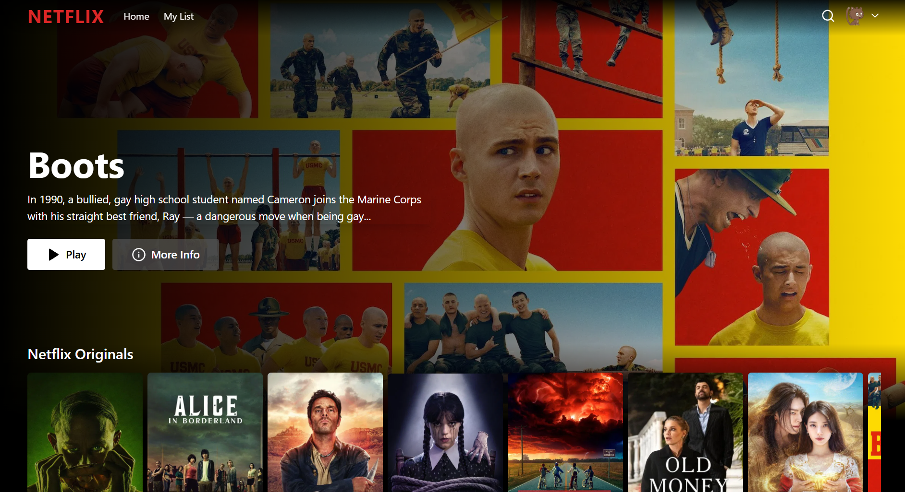

# Netflix Clone - A Full-Stack Streaming App

 This is a feature-rich clone of the popular streaming service, Netflix. Built with a modern tech stack including React, TypeScript, and Supabase, this project replicates the core user experience, from user authentication to browsing and managing a personal watchlist.


## ✨ Features

* **Secure User Authentication:** Full login and signup functionality using Supabase for authentication.
* **Profile Management:** Users can create, select, and manage multiple viewing profiles under a single account.
* **Protected Routes:** Secure application routes that require a user to be logged in and have an active profile selected to view content.
* **Dynamic Content Browsing:** A homepage that fetches and displays movies and TV shows categorized by genre, similar to the real Netflix UI.
* **Movie Details Modal:** Click on any title to open a modal with more information, such as description and rating.
* **My List:** Users can add or remove titles from a personal "My List" for easy access.
* **Search Functionality:** A dedicated search page to find specific movies or shows.
* **Responsive Design:** A clean, responsive user interface built with Tailwind CSS that works on various screen sizes.

---

## 🛠️ Tech Stack

This project leverages a modern, powerful set of technologies:

* **Frontend:**
    * [React](https://reactjs.org/) (with TypeScript)
    * [Vite](https://vitejs.dev/) as the build tool
    * [React Router v6](https://reactrouter.com/) for client-side routing
    * [Tailwind CSS](https://tailwindcss.com/) for styling
* **Backend & Database:**
    * [Supabase](https://supabase.io/) for User Authentication and as the PostgreSQL Database.

---

## 🚀 Getting Started

To get a local copy up and running, follow these simple steps.

### Prerequisites

Make sure you have Node.js and npm installed on your machine.
* Node.js (v16 or later)
* npm

### Installation & Setup

1.  **Clone the repository:**
    ```sh
    git clone [https://github.com//netflix.git](https://github.com/your-username/your-repo-name.git)
    ```

2.  **Navigate to the project directory:**
    ```sh
    cd your-repo-name
    ```

3.  **Install NPM packages:**
    ```sh
    npm install
    ```

4.  **Set up your environment variables:**
    * Create a file named `.env` in the root of your project.
    * You will need to get your API keys from your Supabase project dashboard (`Settings > API`).
    * Add the following variables to your `.env` file:

    ```
    VITE_SUPABASE_URL="YOUR_SUPABASE_PROJECT_URL"
    VITE_SUPABASE_ANON_KEY="YOUR_SUPABASE_ANON_KEY"
    ```

5.  **Run the development server:**
    ```sh
    npm run dev
    ```
    The application should now be running on `http://localhost:5173/`.

---

## 🖼️ Screenshots

*Create a folder named `screenshots` in your project root and add some nice images of your app!*

| Login Page | Profile Selection |
| :---: | :---: |
|  |  |

---
